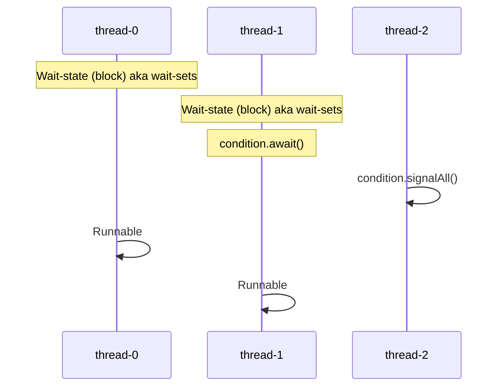

## Introduction to Locks and Multi-Threading

  * **The Problem:** In a multi-threaded application (e.g., users booking seats simultaneously), multiple threads may try to access and update a **shared resource** at the same time, leading to issues (a race condition).
  * **The Solution (Locks):** A **Lock** restricts access to a shared resource, ensuring that **only one thread** can access the resource at any given time.
      * The first thread to acquire the lock becomes the **owner**.
      * All other threads attempting to acquire the lock go into a **waiting state(Queue)**.
      * When the owner thread finishes and calls `unlock()`, the waiting threads become **runnable** and compete to acquire the lock again.

-----

## Implementing `ReentrantLock` in Java

The `ReentrantLock` is the class implementation of the Lock concept.

  * **Initialization:** Create a lock object:

1. Using the ReentrantLock Class (Explicit Locking)
    ```java
    private static ReentrantLock lock = new ReentrantLock(); // Lock object initialized

    private static void accessResource() {
        lock.lock(); // Explicitly acquire the lock
        // access the resource
        lock.unlock(); // Explicitly release the lock
    }

    public static void main(String[] args) {
        Thread t1 = new Thread(() -> accessResource()); t1.start();
        Thread t2 = new Thread(() -> accessResource()); t2.start();
        Thread t3 = new Thread(() -> accessResource()); t3.start();
        Thread t4 = new Thread(() -> accessResource()); t4.start();
    }
    ```
    * **Usage:** The code block that accesses the shared resource must be enclosed by `lock()` and `unlock()` calls.

    * **Critical Best Practice (Safety):** You **must** call the `unlock()` method within a `finally` block.

    * If an exception occurs between `lock()` and `unlock()`, the `unlock()` method might never be called, causing a **deadlock** where other threads remain blocked.
    * Using a `finally` block ensures `unlock()` is always executed.

    ```java
    private static ReentrantLock lock = new ReentrantLock();

    private static void accessResource() {
        lock.lock(); // Acquire the lock
        try {
            // access the resource // Critical Section
        } finally {
            lock.unlock(); // GUARANTEED to be called
        }
    }
    ```

2. Using the synchronized Keyword (Implicit Locking)
    * Monitor Object: The expression synchronized (this) uses the current object (this) as a monitor. The lock associated with this object is acquired upon entry.

    * Automatic Control: The JVM automatically handles the lock:
        * The lock is implicitly acquired upon entering the synchronized block (equivalent to lock.lock()).
        * The lock is implicitly released upon exiting the block, even if the exit is due to an exception (equivalent to lock.unlock() in a finally block).
    
    ```Java
    private void accessResource() {
    synchronized (this) { // Acquire the lock associated with the 'this' object
        // access the resource
    } // Implicitly release the lock when the block exits
    }

    private void accessConcurrently() {
        Thread t1 = new Thread(() -> accessResource()); t1.start();
        Thread t2 = new Thread(() -> accessResource()); t2.start();
        Thread t3 = new Thread(() -> accessResource()); t3.start();
        Thread t4 = new Thread(() -> accessResource()); t4.start();
    }
    ```

-----

## `ReentrantLock` vs. `synchronized` Keyword

| Feature | `synchronized` | `ReentrantLock` |
| :--- | :--- | :--- |
| **Implementation** | **Implicit** (locks on the object itself) | **Explicit** (must create a `ReentrantLock` object) |
| **Flexibility** | Less flexible. Must acquire and release in the same method/block. | **More flexible**. Can acquire in one method and release in another. Can acquire multiple locks in any order. |
| **Extra Features** | No extra methods beyond basic lock/unlock. | Provides advanced methods like `tryLock()` and fairness settings. |

-----

## The "Reentrant" Concept

  * The term **"Reentrant"** means that a thread which already holds the lock can call the `lock()` method again **without blocking itself**.
  * This is useful for **recursive calls**. If a method protected by a lock calls itself, the thread can re-enter the locked block.
  * The lock maintains a **"hold count"** (`getHoldCount()`), which increases with each re-entry. The thread must call `unlock()` the same number of times as it called `lock()`.
  ```java
  private static void accessResource() {
        lock.lock(); 
        lock.lock();
        int number = lock.getHoldCount();
        
        lock.unlock(); 
        lock.unlock(); 
    }
  ```

  ```java
  private static void accessResource() {
    lock.lock(); 
    // ... update shared resource ...
    if (someCondition()) { 
        accessResource(); // getHoldCount will increase based on number of recursions -> Recursive call (re-entry)
    }
    lock.unlock(); 
    } 
  ```

-----

## Fairness and Performance

The `ReentrantLock` constructor allows you to specify a boolean for fairness: `new ReentrantLock(boolean fair)`.
| Feature        | Unfair Lock (Default)                                  | Fair Lock (`new ReentrantLock(true)`)                   |
|----------------|---------------------------------------------------------|-----------------------------------------------------------|
| Constructor    | Default, or `new ReentrantLock(false)`                  | `new ReentrantLock(true)`                                |
| Ordering Policy| Unordered / Barge-in (new threads may acquire immediately) | First-Come, First-Served (respects waiting queue)    |
| Performance    | Faster (minimal overhead)                               | Slightly slower (queue management overhead)               |
| Risk           | Thread Starvation (long-waiting threads may be bypassed) | Prevents Thread Starvation (ensures fairness)           |


-----

## The `tryLock()` Method

The `tryLock()` method allows a thread to attempt to acquire a lock without waiting indefinitely.

1.  **`tryLock()` (No Arguments):**

      * Attempts to acquire the lock. If unavailable, it immediately returns `false` and the thread **does not block**. The thread can proceed to execute alternative logic.

      ```java
        private static ReentrantLock lock = new ReentrantLock();

        private static void accessResource() {
            // Try to acquire the lock; returns false immediately if the lock is held by another thread.
            boolean lockAcquired = lock.tryLock(); 

            if (lockAcquired) {
                try {
                    // Lock acquired: proceed to access the resource
                    // access resource 
                } finally {
                    lock.unlock(); // Release the lock
                }
            } else {
                // Lock not acquired: thread can perform alternate action
                // do alternate thing 
            }
        }
      ```

2.  **`tryLock(timeout, timeunit)`:**

      * The thread will **wait for a specified duration** for the lock to become available.
      * If acquired within the timeout, it returns `true`; otherwise, it returns `false` and continues execution.

      ```java
        private static ReentrantLock lock = new ReentrantLock();

        private static void accessResource throws InterruptedException() {
        
            boolean lockAcquired = lock.tryLock(timeout: 5, TimeUnit.SECONDS); 

            if (lockAcquired) {
                try {
                    // Lock acquired: proceed to access the resource
                    // access resource 
                } finally {
                    lock.unlock(); // Release the lock
                }
            } else {
                // Lock not acquired: thread can perform alternate action
            }
        }
      ```

3.  **`tryLock` and Fairness:**

      * The basic `tryLock()` method **does not honor fairness** and will attempt to "barge in".

      ```java
            private static ReentrantLock lock = new ReentrantLock();
            private static void accessResource {
                boolean lockAcquired = lock.tryLock(); // doesn't honor fairness
            }
        ```

    
      * To make `tryLock()` respect the fairness setting, use a zero-second timeout: `lock.tryLock(0, TimeUnit.SECONDS)`.

      ```java
            private static ReentrantLock lock = new ReentrantLock();

            private static void accessResource throws InterruptedException() {
        
            boolean lockAcquired = lock.tryLock(timeout: 0, TimeUnit.SECONDS); 
            }
        ```

-----

## Other Utility Methods

These methods are primarily used for debugging and testing:

  * `isHeldByCurrentThread()`: Returns `true` if the current thread holds the lock.
  * `getWaitQueueLength()`: Returns the number of threads currently waiting on the lock.

## Lock's Conditional Class


**Wait and Signal**
```java
Lock lock = new ReentrantLock(); 

// 2. Create a Condition object tied to that Lock
Condition condition = lock.newCondition();
```
- The Condition class provides an essential thread coordination mechanism:
    - **Await (Wait State):** If a thread cannot move forward because a specific condition is not met (e.g., a queue is empty), it calls `condition.await()`.
        - The thread immediately releases the lock it holds and goes into a blocked state.
    - **Signal (Wake-up):** A second thread, after performing operations that fulfill the condition (e.g., adding data to the queue), calls `condition.signal()` or `condition.signalAll()`.
        - The Java Virtual Machine (JVM) finds the waiting thread(s) and moves them from the wait state to the runnable state.
        - The awakened thread must reacquire the lock before it can resume execution from the point where it was suspended.
- **Fairness in Signaling**
    - **condition.signal():** Wakes up only one thread, typically the one that has been waiting the longest (First-In, First-Out fairness).

    - **condition.signalAll():** Wakes up all threads waiting on that specific Condition.
- Handling Spurious Wake-Ups 
    - A spurious wake-up happens when a `thread wakes from await() without a signal`.
    - To handle it, always call `condition.await() inside a while loop` that checks the condition.
    - Example:
        ```java
        lock.lock();
        try {
            while (!conditionMet) {
                condition.await();
            }
            // proceed when condition is satisfied
        } finally {
            lock.unlock();
        }
        ```
- Example:
```java
// added: Signals consumer that the producer has added data.
// removed: Signals producer that the consumer has removed data (making space)


Lock lock = new ReentrantLock(); 
Condition added = lock.newCondition();  // Condition for data being added
Condition removed = lock.newCondition(); // Condition for space being made
int count = 0; // Shared resource

// --- Producer Thread ---
public void produce() {
    lock.lock();
    try {
        // Wait for space to be available
        while (count == MAX) { // MAX is the maximum queue capacity
            removed.await(); // Wait for consumer signal
        }
        // ... produce data (count increases) ...

        // Signal the consumer that data is available
        added.signal();

    } finally {
        lock.unlock();
    }
}

// --- Consumer Thread ---
public void consume() {
    lock.lock();
    try {
        // Wait for data to be available
        while (count == 0) { 
            added.await(); // Wait for producer signal
        }
        // ... consume data (count decreases) ...

        // Signal the producer that space is available
        removed.signal(); 

    } finally {
        lock.unlock();
    }
}

```

| Feature              | synchronized Keyword          | Lock + Condition Class        |
|----------------------|--------------------------------|--------------------------------|
| Locking Context      | `synchronized` block or method | Must be called after `lock.lock()` |
| Wait (Suspend)       | `monitor.wait()`               | `condition.await()`            |
| Notify One Thread    | `monitor.notify()`             | `condition.signal()`           |
| Notify All Threads   | `monitor.notifyAll()`          | `condition.signalAll()`        |
